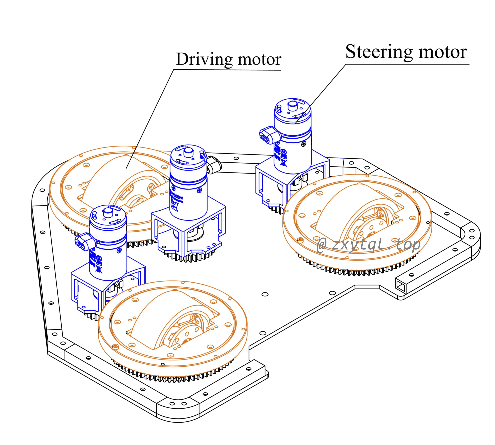
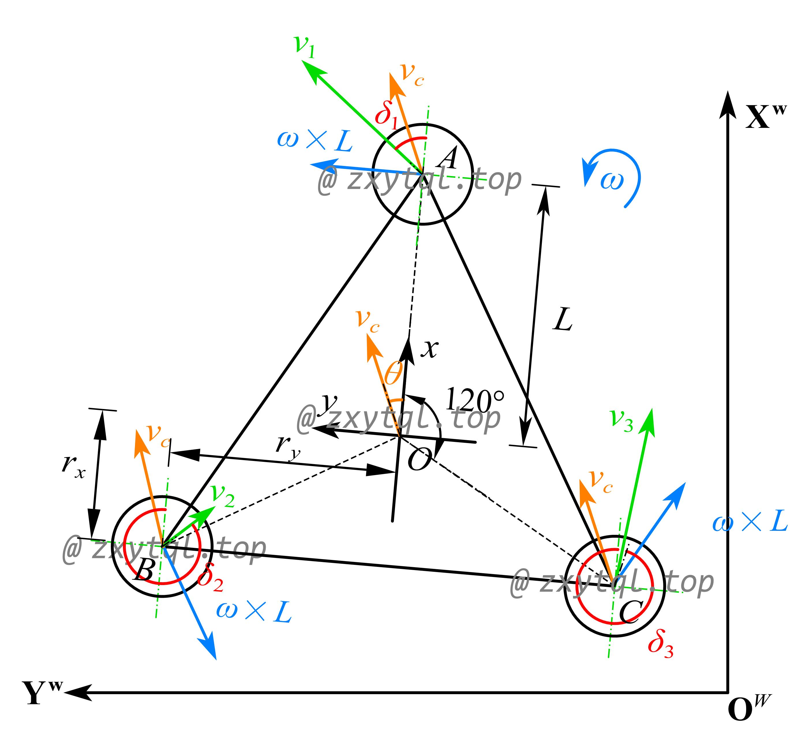
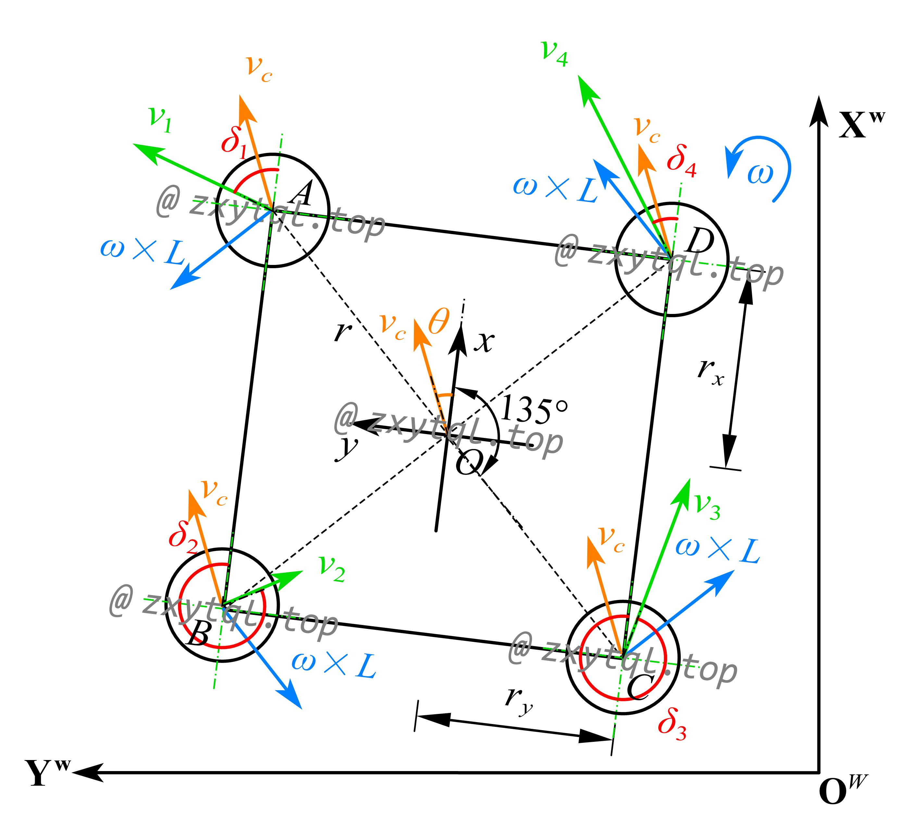

四轮舵轮Webots仿真开源链接：https://github.com/zxytql/Wb_Steering_Wheel

## 三轮舵轮

图1展示了一种简单的三轮舵轮底盘结构图，图2展示了三轮舵轮底盘的全局坐标系、机器人坐标系和轮系坐标系。

 图1. 3WIS robot model 
 

 图2. Kinematics model of 3WIS robot 
 

为了简化运动学模型，我们假设机器人的三个轮子均与地面有良好接触，且每个轮子上的负载相同。$v_i$ 表示第 $i$ 个驱动轮的合速度，$v_c$ 表示机器人中心的速度，$\omega \times r$ 表示机器人自转时对轮系产生的速度，以上均为矢量，满足平行四边形法则，故：
$$
\begin{equation} v_i=\sqrt[]{v_{xi}^2+v_{yi}^2} \end{equation}
$$
结合图2，机器人坐标系中，针对轮A进行分析，存在如下速度关系：
$$
\begin{equation} v_{1x}= v_1\cos\delta _1=v_{cx} \end{equation}
$$

$$
\begin{equation} v_{1y}= v_1\sin\delta _1=v_{cy}+\omega \times L \end{equation}
$$

其中，$L$ 指的是机器人中心到每个轮系的距离，他们是相同的。$r_x$ 和 $r_y$ 分别指机器人中心 $O$ 与轮系中心在 x 轴和 y 轴上的距离。
同样地，针对轮B、轮C进行分析，可以得到：

$$
\begin{equation} v_{2x}= v_2\cos\delta _2=v_{cx}-\omega \times r_y \end{equation}
$$

$$
\begin{equation} v_{2y}= v_2\sin\delta _2=v_{cy}+\omega \times r_x \end{equation}
$$

$$
\begin{equation} v_{3x}= v_3\cos\delta _3=v_{cx}+\omega \times r_y \end{equation}
$$

$$
\begin{equation} v_{3y}= v_3\sin\delta _3=v_{cy}-\omega \times r_x \end{equation}
$$

机器人在全局坐标系下的状态可以表示为 $[\dot{X}^W, \dot{Y}^W, \dot{\theta^W}]$ ，与机器人在机器人坐标系的状态 $[v_x,v_y,\omega ]^\mathrm{T}$ 之间的关系可以表示为：
$$
\begin{equation} \left[\begin{array}{c}
\dot{X}^{W} \\
\dot{Y}^{W} \\
\dot{\theta}
\end{array}\right]=R\left[\begin{array}{c}
v_{x} \\
v_{y} \\
\omega
\end{array}\right] \end{equation}
$$
式中， $R$ 是将机器人坐标速度映射到全局坐标速度的旋转矩阵：
$$
\begin{equation} R = \begin{bmatrix}
 \cos\theta  & -\sin\theta  & 0\\
 \sin\theta  & \cos\theta  & 0\\
 0 & 0 & 1
\end{bmatrix} \end{equation}
$$
结合式子(2)~(7)，三轮舵轮机器人的运动学方程可以用下式表示：
$$
\begin{equation} A\begin{bmatrix}
 v_x\\
 v_y\\
\omega 
\end{bmatrix} =B\begin{bmatrix}
v_1 \\
 v_2\\
v_3
\end{bmatrix} \end{equation}
$$
因此，机器人坐标系中的速度与轮系坐标系中的速度之间的关系可定义为：
$$
\begin{equation} \begin{bmatrix}
 v_x\\
 v_y\\
\omega 
\end{bmatrix} =A^{-1}B\begin{bmatrix}
v_1 \\
 v_2\\
v_3
\end{bmatrix} \end{equation}
$$
其中，$A=\left[\begin{array}{ccc}
1 & 0 & 0 \\
0 & 1 & L \\
1 & 0 & -r_y \\
0 & 1 & -r_x \\
1 & 0 & r_y \\
0 & 1 & r_x
\end{array}\right], B=\left[\begin{array}{ccc}
c \delta_{1} & 0 & 0 \\
s \delta_{1} & 0 & 0 \\
0 & c \delta_{2} & 0 \\
0 & s \delta_{2} & 0 \\
0 & 0 & c \delta_{3} \\
0 & 0 & s \delta_{3}
\end{array}\right]$, $r_x=\frac{L}{2}$, $r_y=\frac{\sqrt{3} }{2} L$

$c(·)$ 和 $s(·)$ 分别指三角函数 $cos(·)$ 和 $sin(·)$。三轮舵轮机器人的正向运动学方程展开如下：
$$
\begin{equation} \left[\begin{array}{c}
v_{x} \\
v_{y} \\
\omega
\end{array}\right]=\frac{1}{3}\left[\begin{array}{ccc}
c \delta_{1} & c \delta_{2} & c \delta_{3} \\
s \delta_{1} & s \delta_{2} & s \delta_{3} \\
S_{1} & S_{2} & S_{3}
\end{array}\right]\left[\begin{array}{c}
v_{1} \\
v_{2} \\
v_{3}
\end{array}\right] \\ \end{equation}
$$
其中，
$$
\begin{bmatrix}
 S_1\\
 S_2\\
S_3
\end{bmatrix}=\begin{bmatrix}\frac{\sin\delta_{1}}{L}
 \\-\frac{\sin\delta_{2}+\frac{\pi }{3} }{L}
 \\\frac{\cos \delta_{3}+\frac{\pi }{6} }{L}
\end{bmatrix}
$$

在机器人学中，$Jacobian $ 矩阵通常用于描述机器人末端执行器的位姿与机器人关节变量之间的关系。对于三轮舵轮机器人来说，机器人的姿态可视为末端执行器，轮系的速度可视为关节变量。因此，$A^{-1} B$ 为机器人运动学的 $Jacobian$ 矩阵。
$$
\begin{equation} \\
\left\{\begin{array}{c}
v_{x}=\frac{1}{3} \sum_{i=1}^{3} v_{i} \cos \delta_{i} \\
v_{y}=\frac{1}{3} \sum_{i=1}^{3} v_{i} \sin \delta_{i} \\
\omega=\frac{1}{3} \sum_{i=1}^{3} S_{i}v_i
\end{array}\right. \\ \end{equation}
$$
机器人中心与每个轮子之间的距离为 $L$，机器人中心与瞬时旋转中心(ICR) 之间的距离为 $R$。公式 (13) 说明了机器人的运动学约束，因此无需根据 ICR 的位置切换算法。机器人可以围绕任意位置移动和旋转。通过在每个控制周期内控制每个轮系的航向角和线速度，可以实现机器人的全向运动。
综上，三轮舵轮机器人在全局坐标系中的正向运动学公式为：
$$
\begin{equation} \left[\begin{array}{c}
\dot{X}^{W} \\
\dot{Y}^{W} \\
\dot{\theta}
\end{array}\right]=\frac{1}{3}\left[\begin{array}{ccc}
c\left(\delta_{1}+\theta\right) & c\left(\delta_{2}+\theta\right) & c\left(\delta_{3}+\theta\right) \\
s\left(\delta_{1}+\theta\right) & s\left(\delta_{2}+\theta\right) & s\left(\delta_{3}+\theta\right) \\
S_{1} & S_{2} & S_{3}
\end{array}\right]\left[\begin{array}{c}
v_{1} \\
v_{2} \\
v_{3}
\end{array}\right] \end{equation}
$$

## 四轮舵轮

图3展示了四轮舵轮底盘的全局坐标系、机器人坐标系和轮系坐标系。

 图3. Kinematics model of 4WIS robot 
 

与三轮舵轮运动学推导类似地，针对轮A、B、C、D进行分析，可以得到：
$$
\begin{equation} v_{1x}= v_1\cos\delta _1 = v_{cx}-\omega \times r_y \end{equation}
$$
$$
\begin{equation} v_{1y}= v_1\sin\delta _1 = v_{cy}+\omega \times r_x \end{equation}
$$
$$
\begin{equation} v_{2x}= v_2\cos\delta _2 = v_{cx}-\omega \times r_y \end{equation}
$$
$$
\begin{equation} v_{2y}= v_2\sin\delta _2 = v_{cy}-\omega \times r_x \end{equation}
$$
$$
\begin{equation} v_{3x}= v_3\cos\delta _3 = v_{cx}+\omega \times r_y \end{equation}
$$
$$
\begin{equation} v_{3y}= v_3\sin\delta _3 = v_{cy}-\omega \times r_x \end{equation}
$$
$$
\begin{equation} v_{4x}= v_4\cos\delta _4 = v_{cx}+\omega \times r_y \end{equation}
$$
$$
\begin{equation} v_{4y}= v_4\sin\delta _4 = v_{cy}+\omega \times r_x \end{equation}
$$

结合式子(15)~(22)，四轮舵轮机器人的运动学方程可以用下式表示：
$$
\begin{equation} A\begin{bmatrix}
 v_x\\
 v_y\\
\omega 
\end{bmatrix} =B\begin{bmatrix}
v_1 \\
 v_2\\
v_3 \\
v_4
\end{bmatrix} \end{equation}
$$
因此，机器人坐标系中的速度与轮系坐标系中的速度之间的关系可定义为：
$$
\begin{equation} \begin{bmatrix}
 v_x\\
 v_y\\
\omega 
\end{bmatrix} =A^{-1}B\begin{bmatrix}
v_1 \\
 v_2\\
v_3 \\
v_4
\end{bmatrix} \end{equation}
$$
其中，$A=\left[\begin{array}{ccc}
1 & 0 & -r_y \\
0 & 1 & r_x \\
1 & 0 & -r_y \\
0 & 1 & -r_x \\
1 & 0 & r_y \\
0 & 1 & -r_x \\
1 & 0 & r_y \\
0 & 1 & r_x
\end{array}\right], B=\left[\begin{array}{ccc}
c \delta_{1} & 0 & 0 & 0 \\
s \delta_{1} & 0 & 0 & 0\\
0 & c \delta_{2} & 0 & 0\\
0 & s \delta_{2} & 0 & 0\\
0 & 0 & c \delta_{3} & 0\\
0 & 0 & s \delta_{3} & 0\\
0 & 0 & 0 & c \delta_{4} \\
0 & 0 & 0& s \delta_{4}
\end{array}\right]$

$c(·)$ 和 $s(·)$ 分别指三角函数 $cos(·)$ 和 $sin(·)$。四轮舵轮机器人的正向运动学方程展开如下：
$$
\begin{equation} \left[\begin{array}{c}
v_{x} \\
v_{y} \\
\omega
\end{array}\right]=\frac{1}{4}\left[\begin{array}{ccc}
c \delta_{1} & c \delta_{2} & c \delta_{3} & c \delta_{4}\\
s \delta_{1} & s \delta_{2} & s \delta_{3} & s \delta_{4}\\
M_{1} & M_{2} & M_{3} & M_{4}
\end{array}\right]\left[\begin{array}{c}
v_{1} \\
v_{2} \\
v_{3} \\
v_4
\end{array}\right] \\ \end{equation}
$$

其中，
$$
\left[\begin{array}{l}
M_{1} \\
M_{2} \\
M_{3} \\
M_{4}
\end{array}\right]=\left[\begin{array}{c}
\frac{r_{x} \sin \delta_{1}-r_{y} \cos \delta_{1}}{r^{2}} \\
\frac{-r_{x} \sin \delta_{2}-r_{y} \cos \delta_{2}}{r^{2}} \\
\frac{-r_{x} \sin \delta_{3}+r_{y} \cos \delta_{3}}{r^{2}} \\
\frac{r_{x} \sin \delta_{4}+r_{y} \cos \delta_{4}}{r^{2}}
\end{array}\right]
$$

综上，四轮舵轮机器人在全局坐标系中的正向运动学公式为：
$$
\begin{equation} \left[\begin{array}{c}
\dot{X}^{W} \\
\dot{Y}^{W} \\
\dot{\theta}
\end{array}\right]=\frac{1}{4}\left[\begin{array}{ccc}
c\left(\delta_{1}+\theta\right) & c\left(\delta_{2}+\theta\right) & c\left(\delta_{3}+\theta\right) & c\left(\delta_{4}+\theta\right)\\
s\left(\delta_{1}+\theta\right) & s\left(\delta_{2}+\theta\right) & s\left(\delta_{3}+\theta\right) & c\left(\delta_{4}+\theta\right)\\
M_{1} & M_{2} & M_{3} & M_{4}
\end{array}\right]\left[\begin{array}{c}
v_{1} \\
v_{2} \\
v_{3} \\
v_4
\end{array}\right] \end{equation}
$$

<i> Last update on: 2024/05/15 </i>
