## 用新时代C/C++开发工具CLion进行STM32开发

STM32作为我做各种开发的主力MCU，以前都是使用Keil5做开发的。其实Keil5已经很老了，除了开发界面不够美观之外，代码补全/纠错功能和编译速度有些时候真的很让人抓狂。但是身边的人做嵌入式开发的时候，几乎是清一色的Keil5，我觉得很大一部分原因可能是很多人都是按照C51 -> STM32这个路线学习过来的，而51单片机就是基于Keil IDE进行开发的，久而久之就沿用下来了吧。

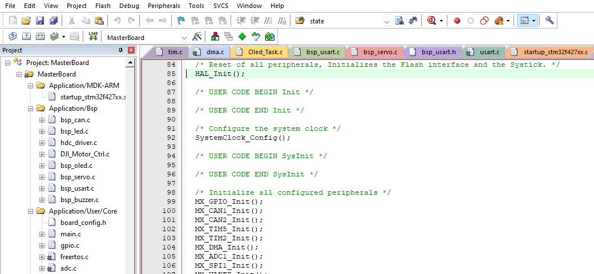

<center> 沧桑的Keil5 </center>

最近接触到了Jetbrains系的CLion，不仅UI深得我心，强大的代码补全功能、顺手的快捷键和整体流畅度都超乎我对IDE的想象，在早些新版本的更新中更是添加了对于STM32CubeMX的支持，在那一瞬间，我仿佛看到了新世界的大门正在向我打开...


<center>怎么说都比Keil帅</center>

虽然Keil年数已高、存在各种难以解决的问题，但是**它绝对是新手入门嵌入式开发的绝佳IDE**，因为它上手简单，配置方便，自带的调试功能还具有实时查看外设和程序变量的功能。

在代码编写上，相信还有很多人在使用ST的标准库，自己进行外设的配置、逻辑编写部分，部分老油条还会对寄存器进行操作以提高程序的运行效率。但是随着ST标准库的停止更新，ST官方的一款开发工具——STM32CubeMX的出现极大方便了开发者进行工程搭建、外设配置、移植到不同芯片等操作，而且使用起来特别方便，ST也在主推使用HAL库或者LL库进行开发，新出的芯片已经没有ST标准库支持了，比如F7系列，也建议大家逐渐向HAL库转移。

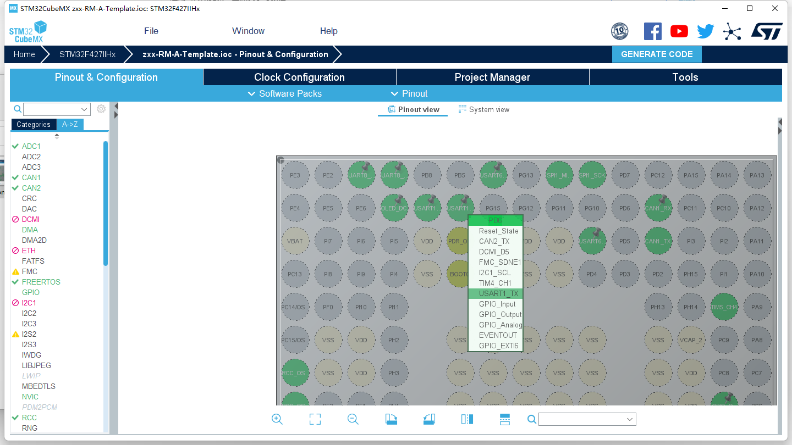

<center>STM32 CubeMX开发界面</center>

### 准备工作

软件环境：

- Windows10 / 11
- STM32CubeMX
- CLion 2021.3.4 Educational
- OpenOCD
- MinGW
- arm-none-eabi-gcc


硬件环境：

- STM32F427
- ST-LINK


### 软件环境配置

1. **STM32CubeMX**

   直接使用最新版的就可以 -> <a href = "https://www.st.com/en/development-tools/stm32cubemx.html">官网下载链接</a>

2. **CLion**

   今天的主角，首次使用可以试用30天，如果是学生可以申请学生开发许可证。目前最新版是`CLion 2021.3`。

3. **OpenOCD**

   Open On-Chip Debugger. CLion需要它的帮助才可以把程序下载到单片机上。下载链接在这里 -> <a href = "https://gnutoolchains.com/arm-eabi/openocd/">SYSPROGS</a>

   下载好后解压到一个文件夹内，待会需要在CLion中配置它的路径


<center>解压OpenOCD</center>


4. **MinGW**

​	CLion需要使用MinGW环境来配置工具链，下面介绍简单的安装过程：

​		a. 下载最新版本的MinGW安装器 ->  <a href="https://www.mingw-w64.org/downloads/">MinGW-w64</a>


<center>MinGW安装工具下载</center>

​		b. 安装完毕后，打开`MinGW Installer`，勾选`Basic Setup`里面全部的Packages，也可以像我一样只勾选需要的组件。


​		c. 根据安装路径，在系统环境变量`Path`中添加../MinGW/bin

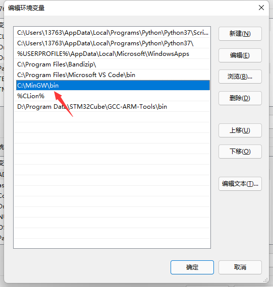

<center>MinGW环境变量</center>

5. **arm-none-eabi-gcc**

   在<a href = "https://developer.arm.com/tools-and-software/open-source-software/developer-tools/gnu-toolchain/gnu-rm/downloads">官网</a>下载压缩包，解压到一个文件夹中：
   
   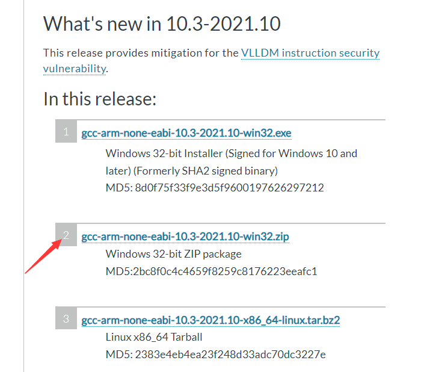

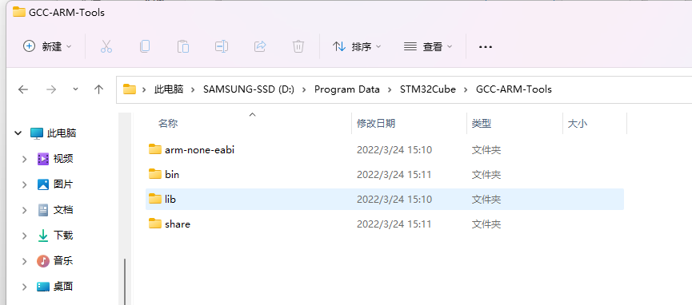

<center>arm-none-eabi-gcc解压</center>

和安装MinGW时一样，将安装目录下的/bin添加到环境变量：

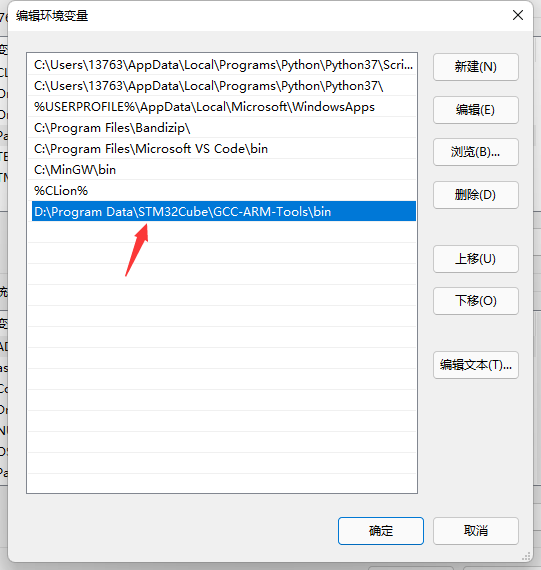

<center>arm-none-eabi-gcc环境变量</center>

在进行4.5步操作后，重启电脑，在命令窗口中输入`gcc -v`


能正常显示版本则说明MinGW安装成功。

输入`arm-none-eabi-gcc -v`

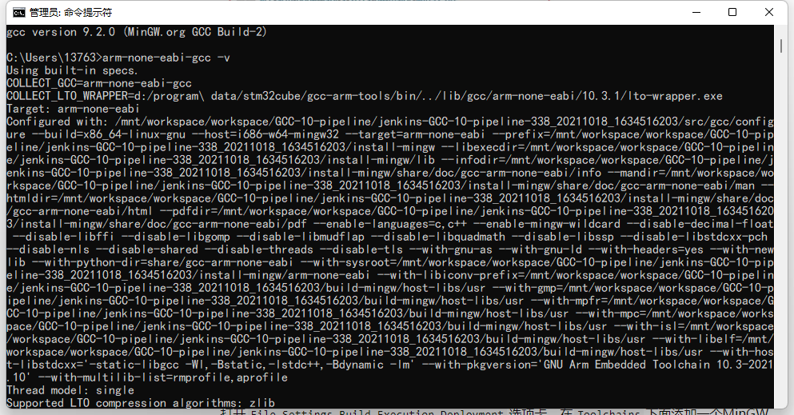

能正常显示版本信息则说明arm-none-eabi-gcc安装成功。

### CLion配置

CLion是基于CMake来管理项目的，所以我们需要配置好预设的MinGW和CMake环境。

1. MinGW配置

   打开CLion的`Settings`，在`Build, Execution, Deployment/ToolChains`中添加一个MinGW环境，CLion会自动识别系统环境变量中的路径进行配置：

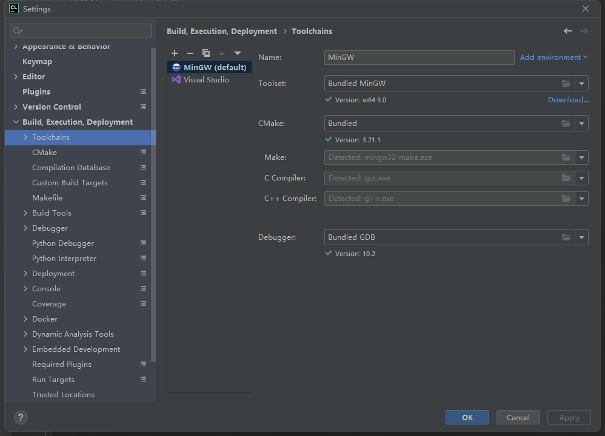

<center>CLion-MinGW配置</center>

如果没有自动配置`C Compiler`和`C++ Compiler`，可以手动选择arm-none-eabi-gcc解压目录中的`../bin/arm-none-eabi-gcc.exe`和`../bin/arm-none-eabi-g++.exe`

2. CMake配置

   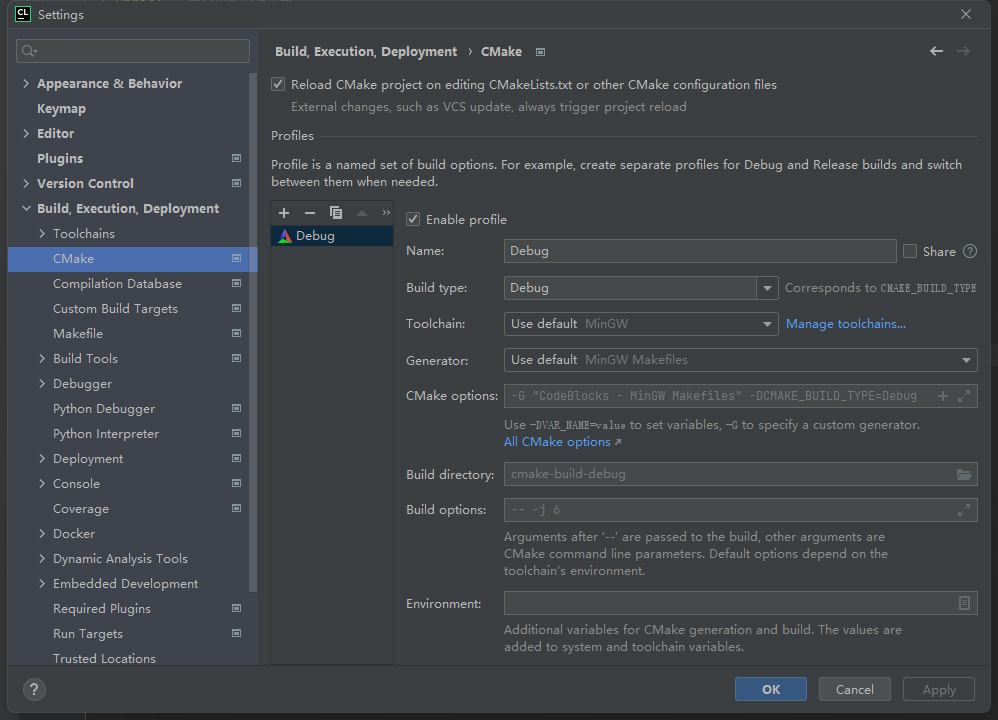

<center>CLion-CMake配置</center>

3. OpenOCD配置

   在`Build, Execution, Deployment/Embedded Development`中，按照OpenOCD和STM32CubeMX的安装路径进行配置。


没有问题的话，接下来就可以开始进行STM32的开发工作了。


### 用STM32CubeMX创建STM32工程

在本节会略过选择芯片、配置时钟频率、配置外设的过程，具体教程可以上网参考。

在STM32CubeMX`Project Manager`中，`Toolchain / IDE`选择`SW4STM32`

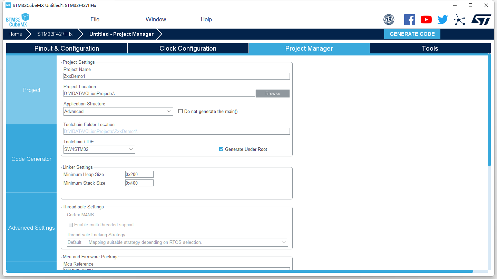

推荐把`Code Generator`中的生成外设初始化文件勾选上，以免出现问题

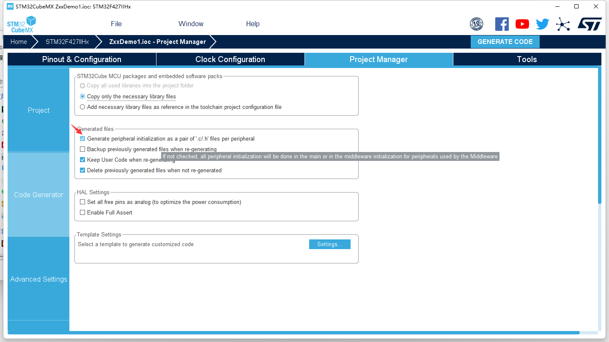

配置完毕后，点击右上角的`GENERATE CODE`，STM32CubeMX会自动生成代码，随后在弹出的窗口中点击`Close`


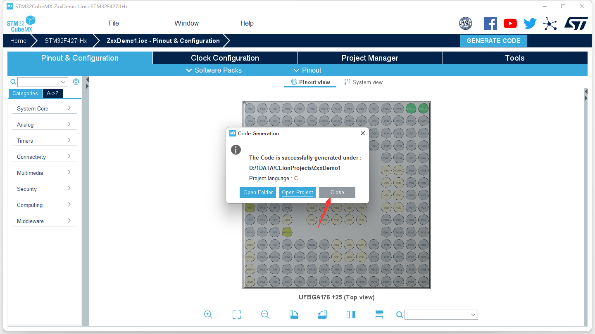


### 在CLion中开发STM32工程

在CLion中，依次点击`File/Open...`，选择刚刚由STM32CubeMX生成的项目路径：


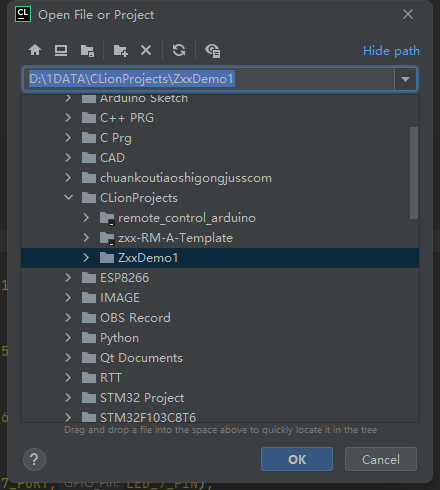

点击`OK`，CLion会自动识别该项目为STM32CubeMX工程。

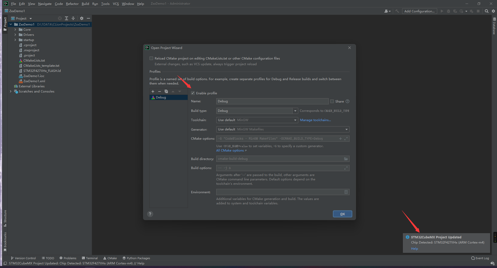

如果左侧Debug项没有问题，可以直接点击`OK`。

> 关于上面的Reload CMake...，意思是当CMake文件有更新（即被用户编辑等）时，会自动重新加载CMake配置，勾选与否看个人喜好

随后会弹出一个窗口让你选择`Board Config Files`，这个主要是用于OpenOCD下载程序时选定下载协议和开发板型号的，我们会自行编写，这里先点击`Cancle`，随后就可以开始编写程序了。


### 编译STM32工程

在CLion顶部工具栏右侧，可以看到显眼的几个按钮，相应意思如下：


<center>CLion编译/构建工具栏说明</center>

直接点击编译，下面会显示编译结果：


无报错即说明代码没有问题，并且在目录下生成了`.hex`和`.bin`文件


### 烧录程序到开发板上

点击下拉栏，可以看到有一个`Edit ...` 按钮


点击进去后，可以看到`Board Config Files`一栏是空的，因为我们刚刚没有选取相应的配置文件

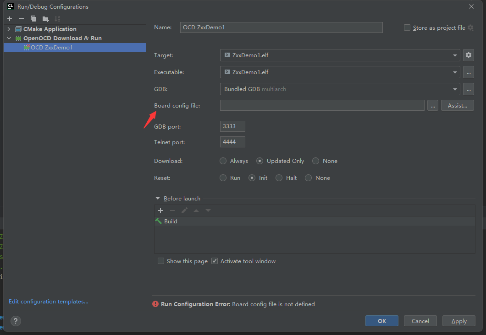

<center>OpenOCD配置框</center>

接下来我们自行编写配置文件，在CLion中，右键项目文件夹，新建一个文件，名字可以随便写，不过必须以`.cfg`作为后缀：


<center>新建一个文件</center>


<center>输入文件名</center>

输入以下内容：

```
# choose st-link/j-link/dap-link etc.
# adapter driver cmsis-dap
# transport select swd

# 选择STlink作为下载器
source [find interface/stlink-v2.cfg]
transport select hla_swd

#选择开发板型号为stm32f4x
source [find target/stm32f4x.cfg]

# download speed = 10MHz
adapter speed 10000
```

随后保存，在OpenOCD配置框，选定该文件作为配置文件：

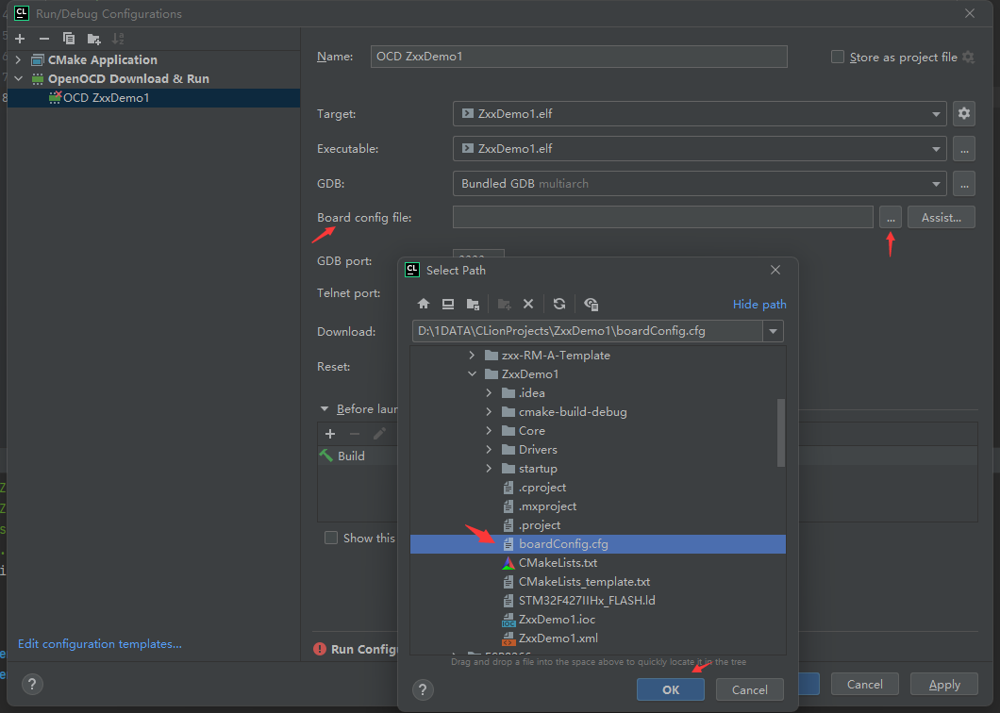

点击下载，下载完成后右边会有提示框：


<center>OpenOCD下载完成</center>

### 用CLion进行调试

CLion是支持全功能的单步断点调试的，但是注意是单步，意味着它不能像Keil一样实时查看变量的值，只有程序暂停了，变量的值才会出现。

如果你刚刚有尝试过点击OpenOCD下载框右边的调试按钮，会发现它是报错的：


我根据这个报错信息，按照网上的一些方法对`OpenOCD`配置以及`Toolchain`都进行了修改，但是还是无法正常Debug，最后发现可以通过自己创建一个`GDB Server`来进行调试，步骤如下：


<center>编辑配置文件</center>


<center>创建Embedded GDB Server</center>

按照下图进行配置：

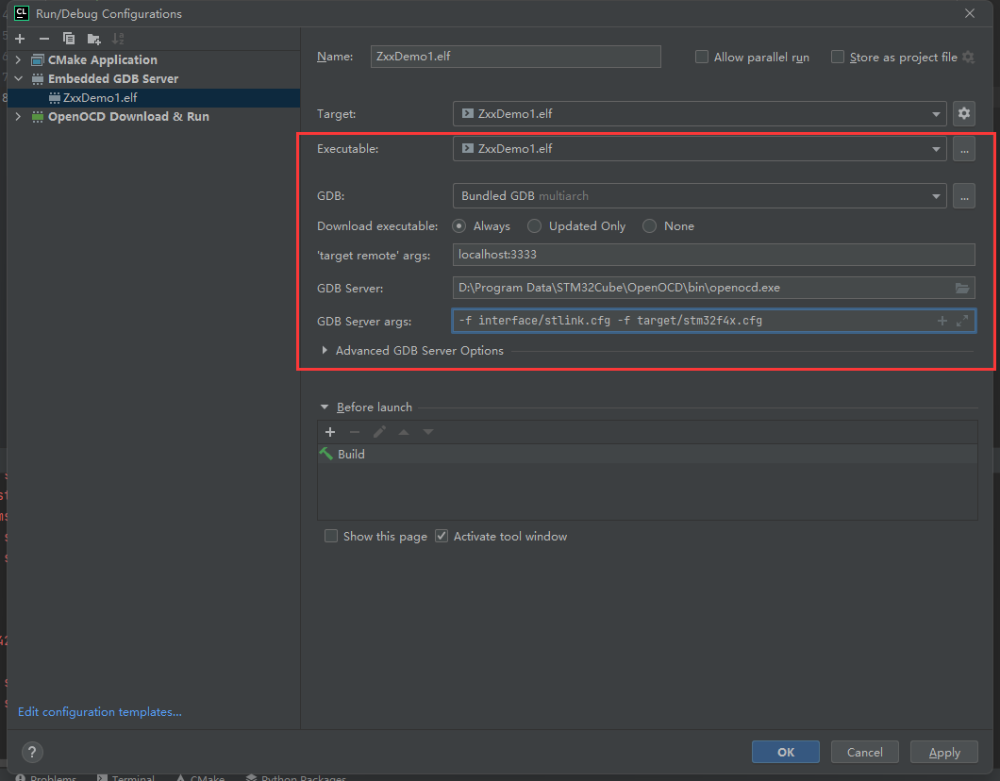

点击`OK`后，在下拉框中选定该配置，右侧调试图标会亮起，点击就可以开始调试了：

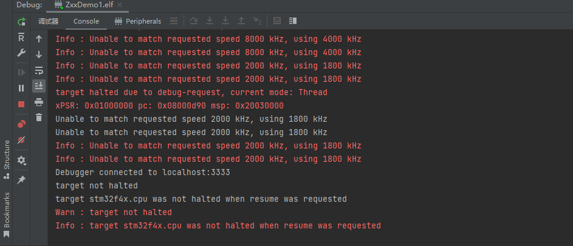


### 一些说明

CLion中编译是基于`CMakeLists.txt`文件的，编译出现问题不仅可能是代码有错误，也有可能是CMakeLists中出现了问题。

1. FreeRTOS编译说明

   在由STM32CubeMX生成的`CMakeLists_template.txt`中，默认是关闭了FPU的，但是FreeRTOS官方文档中有以下注明：

   > FreeRTOS must save/restore also FPU registers when switching task context if application is built with (hard) FPU support enabled. Even if no floating point math is directly used.

​		所以，可以在`CMakeLists.txt`中，取消注释以下部分：

```
#Uncomment for hardware floating point
add_compile_definitions(ARM_MATH_CM4;ARM_MATH_MATRIX_CHECK;ARM_MATH_ROUNDING)
add_compile_options(-mfloat-abi=hard -mfpu=fpv4-sp-d16)
add_link_options(-mfloat-abi=hard -mfpu=fpv4-sp-d16)
```

重新加载CMake文件，重新编译即可。


2. 在CMakeLists.txt中添加编译目录和包含文件夹

   ```
   # 用空格分隔不同目录
   include_directories(Core/Inc Drivers/STM32F4xx_HAL_Driver/Inc 
   					Drivers/STM32F4xx_HAL_Driver/Inc/Legacy Middlewares/Third_Party/FreeRTOS/Source/include 									Middlewares/Third_Party/FreeRTOS/Source/CMSIS_RTOS 
   					Middlewares/Third_Party/FreeRTOS/Source/portable/GCC/ARM_CM4F 	
   					Drivers/CMSIS/Device/ST/STM32F4xx/Include 
   					Drivers/CMSIS/Include 
   					/ 
   					BSP/ 
   					FreeRTOS-Task)
   					
   # 用空格分隔两个路径，用""将文件夹包含
   # *.*表示通配符，也就是这个文件夹里的所有文件都会被编译				
   file(GLOB_RECURSE SOURCES "startup/*.*" "Middlewares/*.*" "Drivers/*.*" "Core/*.*" "BSP/*.*" "FreeRTOS-Task/*.*")					
   ```

   